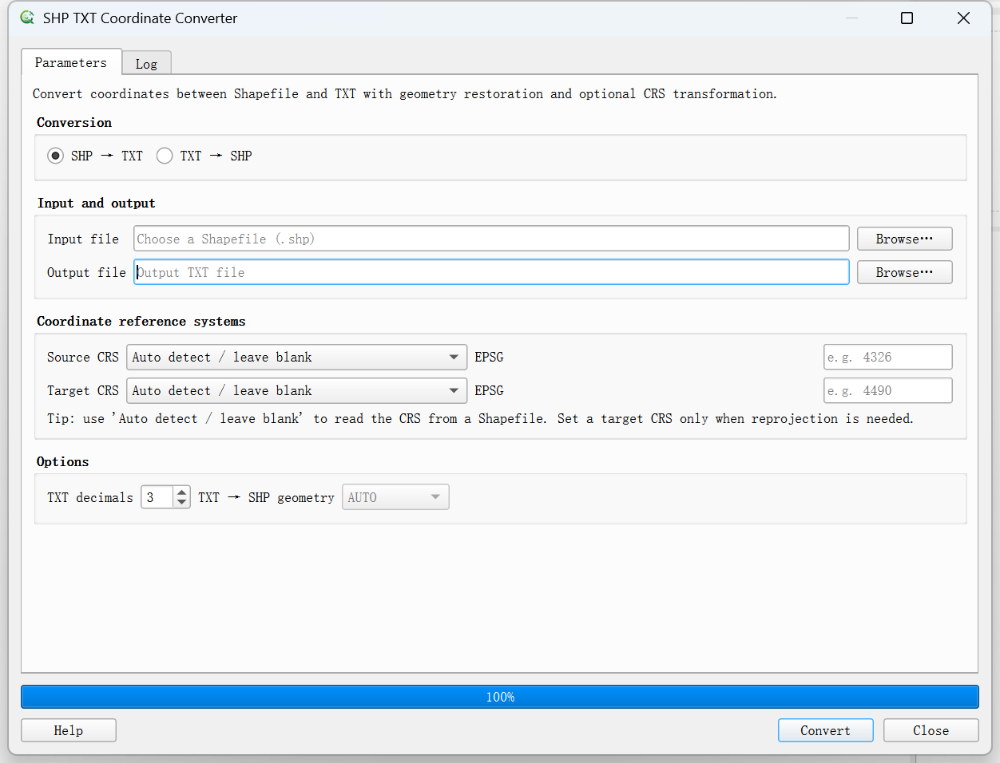

# SHP TXT Coordinate Converter for QGIS

[中文说明](#中文说明)

<p align="center">
  
</p>

A lightweight QGIS plugin for **bidirectional conversion between ESRI Shapefile and structured TXT coordinate files**. It is designed for surveying, cadastral, natural-resources and GIS workflows where coordinate lists need to be exported, edited, checked or restored as vector geometry.

## Features

- SHP → TXT coordinate export.
- TXT → SHP geometry restoration.
- Point, LineString and Polygon support.
- Polygon outer/inner ring preservation.
- Multiple features in one TXT file using `feature_id` blocks.
- Common CGCS2000 3-degree and 6-degree zones, WGS84, Web Mercator and custom EPSG codes.
- Optional CRS transformation using QGIS-bundled GDAL/OGR.
- Traditional GIS X/Y axis order for GDAL 3+/PROJ compatibility.
- Background conversion thread to keep the QGIS interface responsive.
- No external Python package dependencies.

## Interface

<p align="center">
  
</p>

## TXT format

```text
# feature_id=1 geom_type=POLYGON part=outer
500000.000, 3300000.000
500100.000, 3300000.000
500100.000, 3300100.000
500000.000, 3300000.000
```

## Install

For the official QGIS Plugin Repository release, install it from **Plugins → Manage and Install Plugins**. For manual testing, download the plugin ZIP from this repository and install it in QGIS through **Plugins → Manage and Install Plugins → Install from ZIP**.

## Compatibility

- QGIS 3.22–3.99
- Windows / Linux / macOS, subject to the GDAL/OGR build bundled with QGIS

## License

GPL-2.0-or-later. See `LICENSE`.

## Author

Zhang Y.H.  
WeChat Official Account: **测绘地信**  
Email: `zhangyhcumt@163.com`

---

## 中文说明

这是一个用于 **SHP 与 TXT 坐标文件双向互转** 的 QGIS 插件，适用于测绘、地籍、自然资源调查以及常规 GIS 数据处理。

### 主要功能

- SHP → TXT：按要素导出坐标。
- TXT → SHP：根据结构化坐标块恢复几何。
- 支持点、线、面。
- 面要素支持外环与内环。
- 一个 TXT 可保存多个要素，并通过 `feature_id` 自动分隔。
- 内置 CGCS2000 常用 3°带、6°带、WGS84、Web Mercator，也支持自定义 EPSG。
- 支持输入/输出坐标系转换。
- 针对 GDAL 3+/PROJ 统一采用传统 GIS X/Y 轴顺序。
- 后台线程转换，避免长任务阻塞 QGIS 主界面。
- 不依赖额外第三方 Python 包。

### 软件界面

<p align="center">
  
</p>

### 注意事项

TXT 文件本身不保存 CRS 信息。如果需要把 TXT 坐标转换到另一个坐标系，请明确指定输入 EPSG；若输出坐标系留空，则保持输入坐标系。
